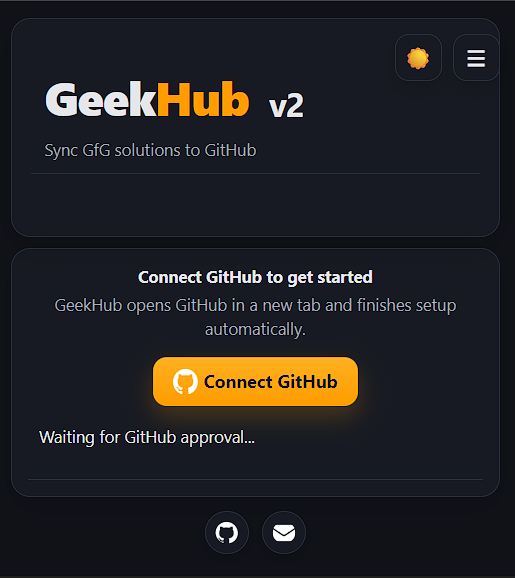
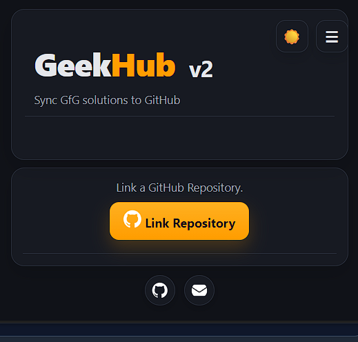
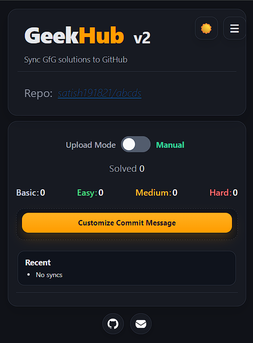
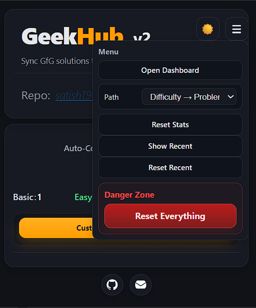
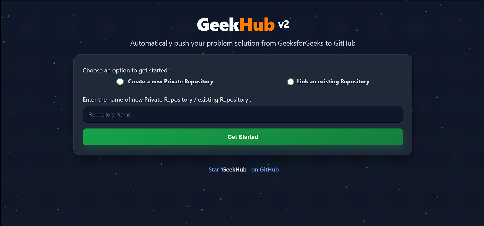
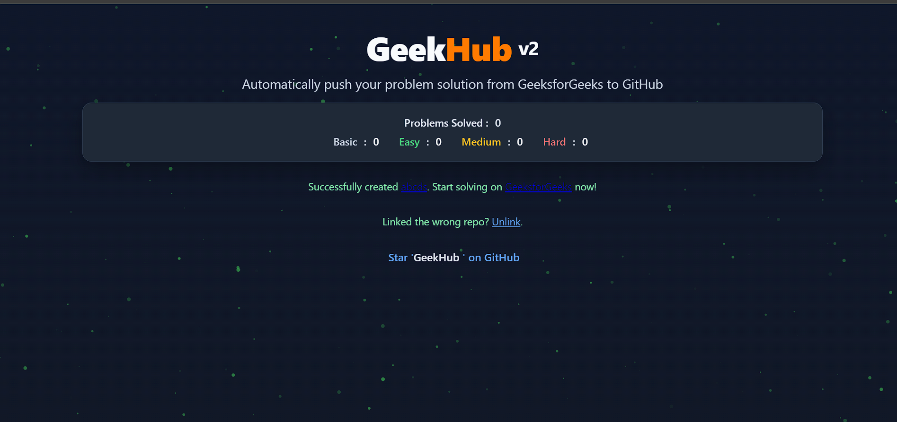
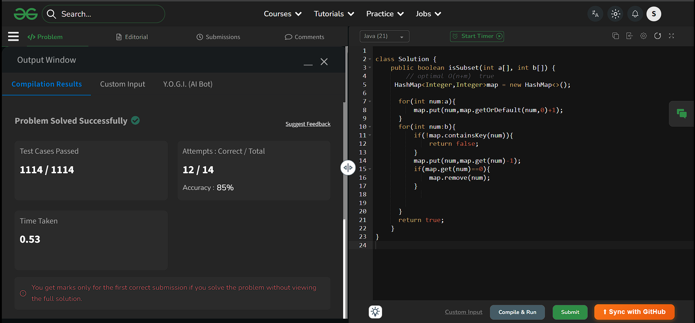

  
  
  

# 
GeekHub v2

> Fork attribution: Original project by [Atharva Nanavate](https://github.com/AtharvaNanavate/GfG-To-GitHub).

This Chrome Extension syncs your GeeksForGeeks problem solutions to a GitHub repository. It helps you centralize your solutions, track your progress, and build your GitHub portfolio.

## Installation

### Option A: Local install (recommended)

- Download this repository as a ZIP and extract it.
- Open `chrome://extensions/` in Chrome.
- Enable **Developer mode** (top-right).
- Click **Load unpacked** and select this project folder.
- Pin **GeekHub v2** from the Extensions menu and open the popup.

### Option B: Old Chrome Web Store build (alternative)

- If you want to use the older published build, install from:
  [Old Web Store Listing](https://chrome.google.com/webstore/detail/gfg-to-github/gojabhkegjnlnklkkpkglaembhlknkgk)

## Features

- **Create or Link Repository**: Easily create a new GitHub repository or link an existing one.
- **Dashboard**: A popup dashboard shows difficulty-level-wise counts of solved problems.
- **Organized Repository**: Solutions are pushed into directories named by difficulty level.
- **Detailed READMEs**: A README.md file with problem details is created for each solution.
- **Multi-language Support**: Supports submissions in multiple languages like Java and C++.
- **Sync on Success**: Solutions are committed only after successful submission on GeeksForGeeks.
- **Manual & Auto Sync**: Toggle between manual and automatic syncing from the popup.
- **Dark Mode**: The popup features a Dark Mode toggle for your preferred theme.

## Illustrations

### Popup Screens

- Authorization (device auth / connect state)

</a>

- Link repository (popup)

</a>

- Dashboard (popup)

</a>

- Hamburger menu (popup)

</a>

### Dashboard Screens

- Create or link repository (home page)

</a>

- Dashboard (home page)

</a>

### In-Problem Experience

- Manual sync button on problem page

</a>

